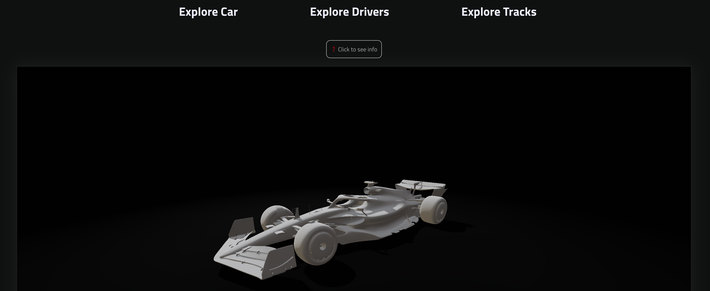

# Explore F1 car

As a F1 fan i wanted to create a site where user can interact with 3d model of a f1 car and see what elements are f1 car built from with a little technical details. I took this oportunity to learn a bit about js library three.js. Also learned basics of a Vue framework and how to get data from an external API.

# Learned building this.

- Vue.js
- Async js data from API
- Figma prototype

### Screenshot

### Built with

- Vue.js
- Javascript
- CSS
- Three.js

## To do next

To continue learning i will work on these tasks

- refactor the code
- fix performance of a 3D view
- add more tracks
- add more data for drivers
